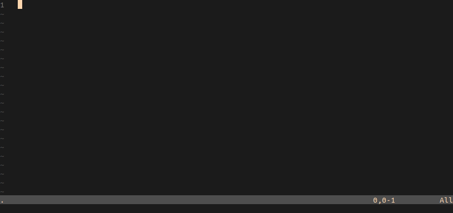

# HelloVim

In a NeoVim terminal, open the given file in a new buffer



## Instalation

Install dependencies
```
  apt install ruby
  gem install msgpack-rpc
```

Install HelloVim
```
  git clone git@github.com:gmonein/HelloVim.git
  cd HelloVim
  ln -s ./bin/hello_vim $HOME/.local/bin
```

## Usage

```
  hello_vim file
```
